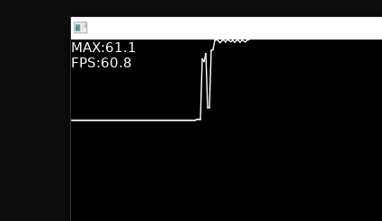

# Love.Misc.FPSGraph

> A small FPS graphing utility for LOVE, adapt from https://github.com/icrawler/FPSGraph .

```C#
using Love;
using Love.Misc.FPSGraph;

class TestScene : Scene
{
    public override void Update(float dt)
    {
        FPSGraph.Update(dt);
    }

    public override void Draw()
    {
        FPSGraph.Draw();
    }

    static void Main(string[] args)
    {
        Boot.Run(new TestScene());
    }
}
```

