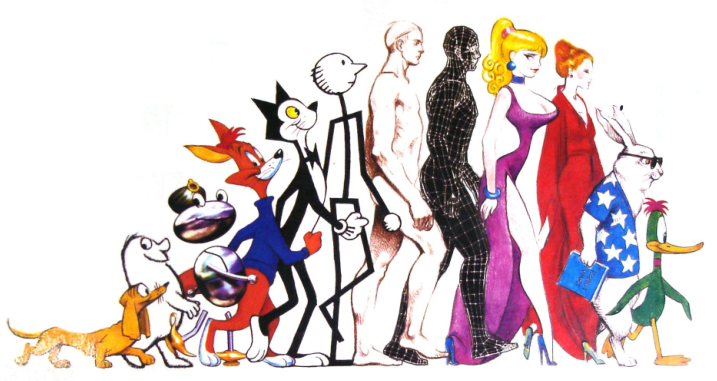
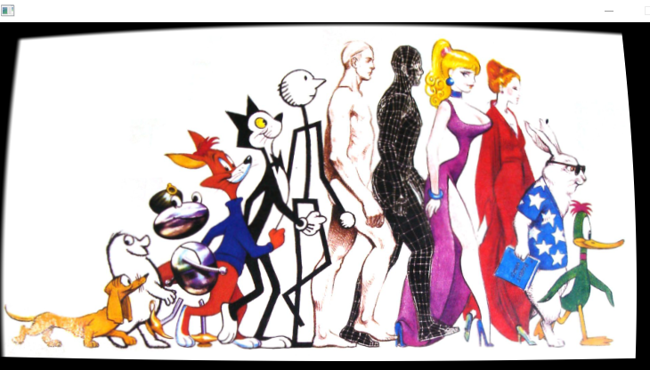
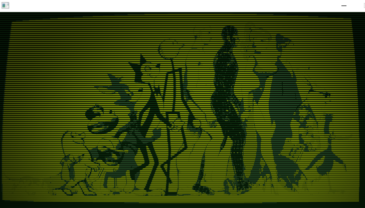

# Love.Misc.Moonshine.Moonshine
> Postprocessing effect repository for LÖVE. adapt from https://github.com/vrld/moonshine . more resource https://www.love2d.org/forums/viewtopic.php?t=3733 .

Raw image -> Raw image + CRT -> Raw CRT + DMG + Scanlines + Vignette

 



draw with CRT
```C#
class TestMoonShine : Scene
{
    Moonshine ms;
    Image img;

    public override void Load()
    {
        ms = Moonshine.China(Moonshine.CRT.Default);
        img = Graphics.NewImage("res/img.png");
    }

    public override void Draw()
    {
        ms.Draw(() =>
        {
            Graphics.Draw(img);
        });
    }
}
```


draw with CRT + DMG + Scanlines + Vignette
```C#
class TestMoonShine : Scene
{
    Moonshine ms;
    Image img;

    public override void Load()
    {
        ms = Moonshine.China(Moonshine.CRT.Default)
                .Next(Moonshine.DMG.Default)
                .Next(Moonshine.Scanlines.Default)
                .Next(Moonshine.Vignette.Default)
            ;
        img = Graphics.NewImage("res/img.png");
    }

    public override void Draw()
    {
        ms.Draw(() =>
        {
            Graphics.Draw(img);
        });
    }
}
```

---
#### Module can use : 
| Module   |Description |
|:---------|:-----------|
|Love.Misc.Moonshine.Moonshine.Chromasep|cheap/fake chromatic aberration|
|Love.Misc.Moonshine.Moonshine.ColorGradeSimple|weighting of color channels|
|Love.Misc.Moonshine.Moonshine.CRT|crt/barrel distortion|
|Love.Misc.Moonshine.Moonshine.Desaturate|desaturation and tinting|
|Love.Misc.Moonshine.Moonshine.DMG|Gameboy and other four color palettes|
|Love.Misc.Moonshine.Moonshine.FastGaussianBlur|faster Gaussian blurring              Bilinear Gaussian blur filter as detailed here: http://rastergrid.com/blog/2010/09/efficient-gaussian-blur-with-linear-sampling/              Produces near identical results to a standard Gaussian blur by using sub-pixel sampling, this allows us to do ~1/2 the number of pixel lookups.              unroll convolution loop|
|Love.Misc.Moonshine.Moonshine.FilmGrain|image noise|
|Love.Misc.Moonshine.Moonshine.GaussianBlur|gaussian blur|
|Love.Misc.Moonshine.Moonshine.Glow|aka (light bloom)|
|Love.Misc.Moonshine.Moonshine.Godsray|aka light scattering|
|Love.Misc.Moonshine.Moonshine.Pixelate|sub-sampling (for that indie look)|
|Love.Misc.Moonshine.Moonshine.Posterize|restrict number of colors|
|Love.Misc.Moonshine.Moonshine.Scanlines|horizontal lines|
|Love.Misc.Moonshine.Moonshine.Sketch|simulate pencil drawings|
|Love.Misc.Moonshine.Moonshine.Vignette|shadow in the corners|


------------------------------------------------
#### Love.Misc.Moonshine.Moonshine.DoubleBufferCanvas.Swap

`Summary`: Swap Front and Back. (Back, Front = Front, Back)


------------------------------------------------
#### Love.Misc.Moonshine.Moonshine.DoubleBufferCanvas.Swap(Love.Shader)

`Summary`: Swap Front and Back with shader. (Back, Front = Front, Back)


------------------------------------------------
#### Love.Misc.Moonshine.Moonshine.DrawWithShader(Love.Canvas,Love.Canvas,Love.Shader)

`Summary`: this function uses shader to draw the Source buffer to the Dest buffer with given Shader.


`Arguments`

* `dest`: Canvas that ready to draw as target
* `source`: Canvas to draw
* `shader`: Shader used when draw source canvas to dest canvas


------------------------------------------------
#### Love.Misc.Moonshine.Moonshine.China(Love.Misc.Moonshine.Moonshine.Effect)

`Summary`: Create MoonShine


`Arguments`

* `w`: 
* `h`: 
* `e`: 


------------------------------------------------
#### Love.Misc.Moonshine.Moonshine.Create(System.Int32,System.Int32,Love.Misc.Moonshine.Moonshine.Effect)

`Summary`: Create MoonShine With width and height


`Arguments`

* `e`: 


------------------------------------------------
#### Love.Misc.Moonshine.Moonshine.BoxBlur.#ctor

`Summary`: default BoxBlur constructor


