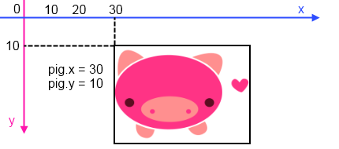
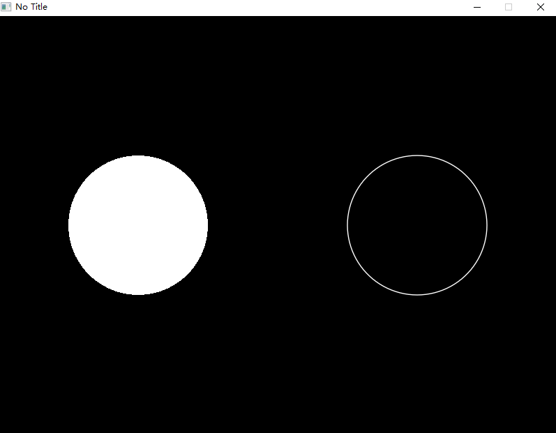
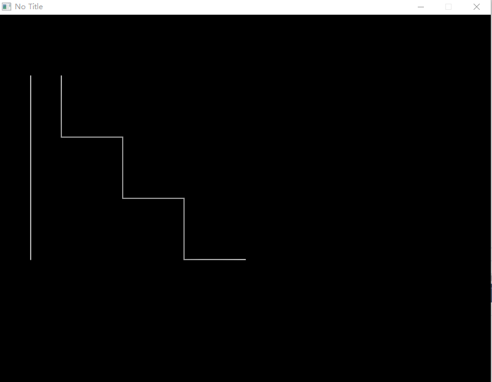
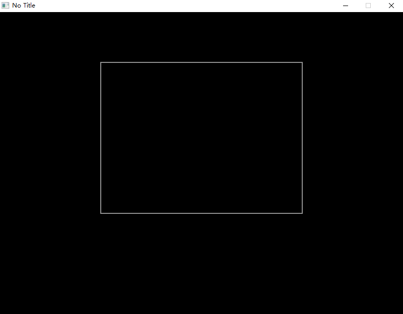
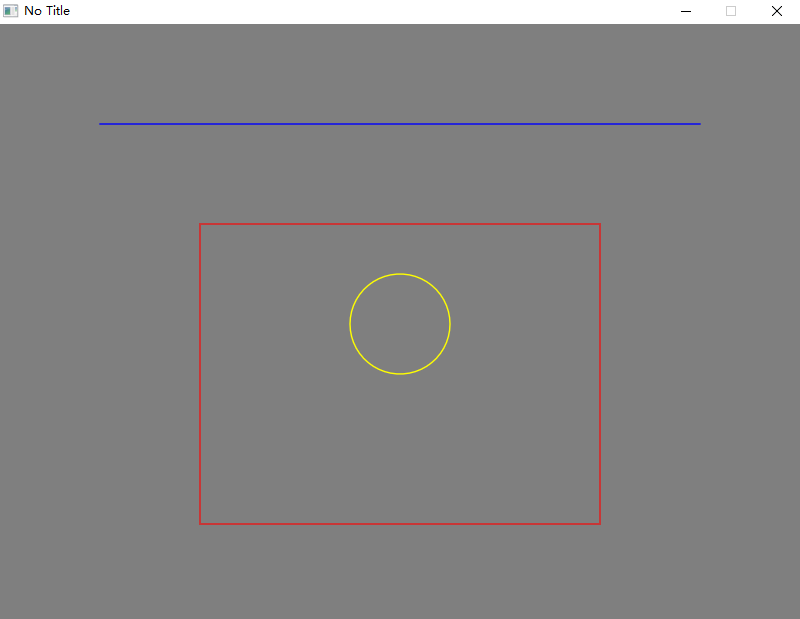

> 感谢、本章由 [fanbal@gitee](https://gitee.com/fanbal)  :smile: [完成](https://gitee.com/endlesstravel/love2dCS/issues/I3R31K) 


# 基本绘图

在这一节，我们将会来学习如何绘制基本图形。

## 基础


`Love.Graphics`类的主要职责是在屏幕上绘制线条`Line`、形状`Shape`、文本`Text`、图像`Iamge`和其他可绘制的`Drawable`对象。它的次要职责包括将外部文件（包括图像`Image`和字体`Font`）加载到内存中，创建专门的对象（如粒子系统`ParticleSystem`或画布`Canvas`）以及管理画面的几何图形。
LÖVE的坐标系原点位于画面的左上角(0, 0)。其中水平方向为X轴，越往右侧，其代表的值越大。垂直方向为Y轴：越往底部。其代表的值越大。
值得注意的是，位置(0, 0)与像素的左上角对齐，这意味着对于某些函数，在绘制1像素宽的线时，在渲染过程中可能会遇到off-by-one的问题。可以尝试将坐标系与像素中心对齐，而不是与像素的左上角对齐。通过传递 `x + 0.5f` 和 `y + 0.5f` 或者使用`Love.Graphics.Translate()`来解决。
 



## 画两个圆

让我们绘制两个圆形。

``` C#
using Love;
class Program : Scene
{
    public override void Draw()
    {
        // 在(200,300)处绘制一个半径为100填充模式的圆形。
        Graphics.Circle(DrawMode.Fill, 200, 300, 100);

        // 在(600,300)处绘制一个半径为100线框模式的圆形。
        Graphics.Circle(DrawMode.Line, 600, 300, 100);
    }

    static void Main(string[] args)
    {
        Boot.Init();
        Boot.Run(new Program());
    }
}
```



## 绘制线条

首先让我们绘制一条独立的直线，然后绘制通过直线绘制出一个阶梯状的图形。

```C#
using Love;
class Program : Scene
{
    public override void Draw()
    {
        // 绘制一条起点(50, 100)终点(50, 400)的直线。
        Graphics.Line(50, 100, 50, 400);

        // 使用多条线绘制一个阶梯状图形。
        Graphics.Line(
            100, 100, 100, 200,
            200, 200, 200, 300,
            300, 300, 300, 400,
            400, 400
            );
    }

    static void Main(string[] args)
    {
        Boot.Init();
        Boot.Run(new Program());
    }
}
```



## 绘制矩形
Let's draw an outlined rectangle here.
让我们绘制一个矩形的轮廓。

``` C#
using Love;
class Program : Scene
{
    public override void Draw()
    {
        Graphics.Rectangle(DrawMode.Line, 200, 100, 400, 300);
    }

    static void Main(string[] args)
    {
        Boot.Init();
        Boot.Run(new Program());
    }
}
```



## 具有颜色的图形

> Love2dCS 使用介于`0.0f`与`1.0f`之间的`float`字段描述每个`Love.Color`结构中的RGBA部分（RGBA：Red、Green、Blue、Alpha）。举个例子：

+ (1f, 0f, 0f, 1f) 表示红色。
+ (0f, 0f, 1f, 1f) 表示蓝色。
+ (0.8f, 0.8f, 0.8f, 1) 表示灰色。
+ (1f, 0f, 0f, 0.5f) 表示半透明的红色。

可以使用`Graphics.SetColor()`设置当前画刷的颜色。
让我们绘制一个红色轮廓的矩形、黄色轮廓的圆形与一条蓝色的直线。

```C#
using Love;
class Program : Scene
{
    public override void Draw()
    {
        // 将背景色设为灰色。
        // 在每帧开始前，它都会刷新窗口的填充颜色。
        // 因此，您可能只会调用一次。
        Graphics.SetBackgroundColor(0.5f, 0.5f, 0.5f, 1);

        // 红色边框的矩形。
        Graphics.SetColor(1, 0, 0); // 如果不为Alpha设置参数，它默认是1.0f。
        Graphics.Rectangle(DrawMode.Line, 200, 200, 400, 300);

        // 蓝色直线。
        var blueColor = new Color(0.0f, 0.0f, 1.0f, 1.0f); // 你可以使用Color结构体来对其设置。
        Graphics.SetColor(blueColor);
        Graphics.Line(100, 100, 700, 100);

        // 黄色轮廓圆形。
        Graphics.SetColor(Color.Yellow); // 或者使用预设的颜色，您可以通过调用Color类型的静态字段获得更多预设颜色。
        Graphics.Circle(DrawMode.Line, 400, 300, 50);
    }

    static void Main(string[] args)
    {
        Boot.Init();
        Boot.Run(new Program());
    }
}
```



