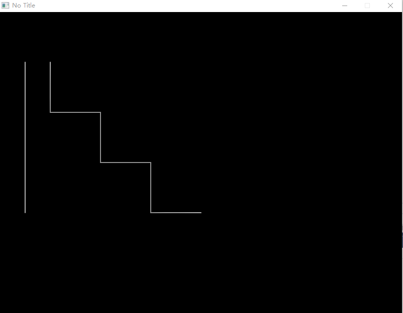

# Basic Graphics

In this chapter, we will learn how to draw basic shapes.

## Basics

The primary responsibility of the `Love.Graphics` class is drawing lines, shapes, text, `Image`s, and other `Drawable` objects onto the screen. Its secondary responsibilities include loading external files (including `Image`s and `Font`s) into memory, creating specialized objects (such as `ParticleSystem`s or `Canvas`es), and managing screen geometry.

?> While you can load graphical assets from disk via `Love.Graphics`, we recommend using the `Resource` class, as that allows you to load from anywhere, not just from within the working folder.

LÖVE's coordinate system is rooted in the upper-left corner of the screen, which is at location (0, 0). The x axis is horizontal: larger values are further to the right. The y axis is vertical: larger values are further towards the bottom.

It is worth noting that the location (0, 0) aligns with the upper-left corner of the pixel as well, meaning that for some functions, you may encounter off-by-one problems in the render output when drawing 1 pixel wide lines. You can try aligning the coordinate system with the center of pixels rather than their upper-left corner. Do this by passing `x + 0.5f` and `y + 0.5f` or using `Love.Graphics.Translate()`.


## Draw Two Circles

Let's draw two circles.

```C#
using Love;
class Program : Scene
{
    public override void Draw()
    {
        // Draw a filled circle at 200,300 with a radius of 100.
        Graphics.Circle(DrawMode.Fill, 200, 300, 100);

        // Draw an outlined circle at 600,300 with the same radius.
        Graphics.Circle(DrawMode.Line, 600, 300, 100);
    }

    static void Main(string[] args)
    {
        Boot.Init();
        Boot.Run(new Program());
    }
}
```


## Draw Lines

Let's draw a single isolated straight line first. And then a few lines to form a "staircase" shape.

```C#
using Love;
class Program : Scene
{
    public override void Draw()
    {
        // Draw a line from 50,100 to 50,400.
        Graphics.Line(50, 100, 50, 400);

        // Draw a "staircase" shape by drawing multiple lines.
        Graphics.Line(
            100, 100, 100, 200,
            200, 200, 200, 300,
            300, 300, 300, 400,
            400, 400
            );
    }

    static void Main(string[] args)
    {
        Boot.Init();
        Boot.Run(new Program());
    }
}
```




## Draw Rectangle

Let's draw an outlined rectangle here.

```C#
using Love;
class Program : Scene
{
    public override void Draw()
    {
        Graphics.Rectangle(DrawMode.Line, 200, 100, 400, 300);
    }

    static void Main(string[] args)
    {
        Boot.Init();
        Boot.Run(new Program());
    }
}
```


## Colored Shapes

> Love2dCS uses floats in the range from 0.0 to 1.0 to represent each component of the RGBA `Love.Color` struct. For example:
  - (1, 0, 0, 1) is red.
  - (0, 0, 1, 1) is blue.
  - (0.8f, 0.8f, 0.8f, 1) is grey.
  - (1, 0, 0, 0.5f) is translucent red.

Use `Graphics.SetColor()` to set the color of any subsequent drawing. Let's draw a red rectangle, a yellow circle, and a blue line.

```C#
using Love;
class Program : Scene
{
    public override void Draw()
    {
        // Set the background color to grey.
        // This is the clear color the window will fill with at the start of every frame.
        // Thus, you likely want to call this only once.
        Graphics.SetBackgroundColor(0.5f, 0.5f, 0.5f, 1);

        // Red rectangle.
        Graphics.SetColor(1, 0, 0); // Unspecified Alpha component defaults to 1.
        Graphics.Rectangle(DrawMode.Line, 200, 200, 400, 300);

        // Blue line.
        var blueColor = new Color(0.0f, 0.0f, 1.0f, 1.0f); // You can use the Color struct.
        Graphics.SetColor(blueColor);
        Graphics.Line(100, 100, 700, 100);

        // Yellow circle.
		Graphics.SetColor(Color.Yellow); // Or a predefined constant.
		Graphics.Circle(DrawMode.Line, 400, 300, 50);
    }

    static void Main(string[] args)
    {
        Boot.Init();
        Boot.Run(new Program());
    }
}
```


<!---
## Text

Let's draw some text.

```C#
using Love;
class Program : Scene
{
    public override void Draw()
    {
        Graphics.Print("In case I don't see ya', good afternoon, good evening and good night.");
    }

    static void Main(string[] args)
    {
        Boot.Init();
        Boot.Run(new Program());
    }
}
```

-----------------------------------------------------------------------
--->