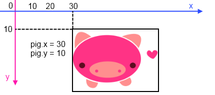
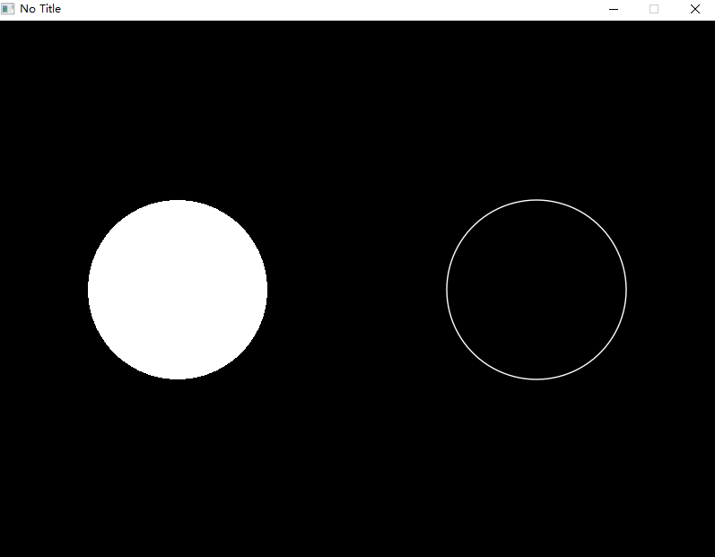
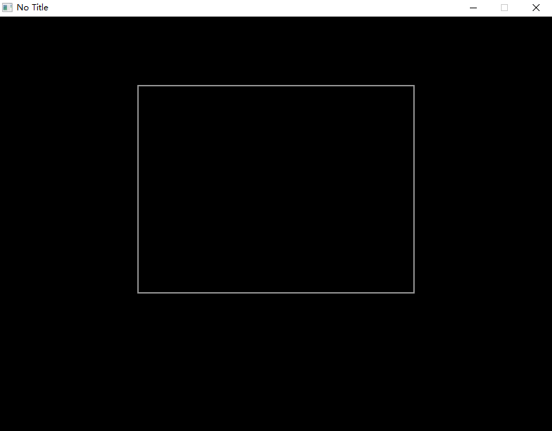
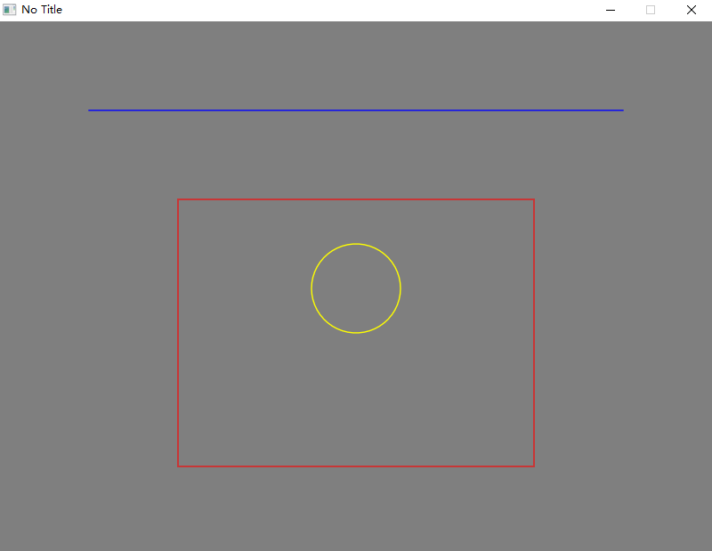

# Basic Graphics

> In this chapter you will learn how to draw a cricle, line, rectangle and print a text on screen. And draw the graphics with the colors you like.
### First you need to know

> The primary responsibility for the Love.Graphics module is the drawing of lines, shapes, text, Images and other Drawable objects onto the screen. Its secondary responsibilities include loading external files (including Images and Fonts) into memory, creating specialized objects (such as ParticleSystems or Canvases) and managing screen geometry.

> LÖVE's coordinate system is rooted in the upper-left corner of the screen, which is at location (0, 0). The x axis is horizontal: larger values are further to the right. The y axis is vertical: larger values are further towards the bottom. It is worth noting that the location (0, 0) aligns with the upper-left corner of the pixel as well, meaning that for some functions you may encounter off-by-one problems in the render output when drawing 1 pixel wide lines. You can try aligning the coordinate system with the center of pixels rather than their upper-left corner. Do this by passing x+0.5 and y+0.5 or using Love.Graphics.Translate().



### Draw two circle
Draw a circle with a radius of 100 at the position of (200, 300).
And draw a circle with a radius of 100 at the position of (600, 300).
```C#
    using Love;
    class Program : Scene
    {
        public override void Draw()
        {
            Graphics.Circle(DrawMode.Fill, 200, 300, 100); // Draw the circle
            Graphics.Circle(DrawMode.Line, 600, 300, 100); // Draw outlined circle.
        }

        static void Main(string[] args)
        {
            Boot.Init();
            Boot.Run(new Program());
        }
    }
```

-----------------------------------------------------------------------
### Draw a line
Drawing a line from (200, 200) to (400, 400) on the window.
And Drawing a stepped shape graphic.
```C#
    using Love;
    class Program : Scene
    {
        public override void Draw()
        {
             // A line from (200, 200) to (400, 400)
            Graphics.Line(200, 200, 400, 400);

            // Draw a stepped shape graphic
            Graphics.Line(
                100, 100, 100, 200,
                200, 200, 200, 300,
                300, 300, 300, 400,
                400, 400
                );
        }

        static void Main(string[] args)
        {
            Boot.Init();
            Boot.Run(new Program());
        }
    }
```

-----------------------------------------------------------------------
### Draw a rectangle
Draw a rectangle with a width of 200 and a height of 100 at the (200, 200) position of the screen.
```C#
    using Love;
    class Program : Scene
    {
        public override void Draw()
        {
            Graphics.Rectangle(DrawMode.Line, 200, 100, 400, 300);
        }

        static void Main(string[] args)
        {
            Boot.Init();
            Boot.Run(new Program());
        }
    }
```

-----------------------------------------------------------------------
### Colored circle, line, rectangle

?> Love use float from 0.0 to 1.0 to represent each component on RGBA color. for example (1, 0, 0, 1) means a red color, (0, 0, 1, 1) means a blue color, (0.8f, 0.8f, 0.8f, 1) means grey color, (1, 0, 0, 0.5f) means translucent red.

using `Graphics.SetColor` drawing a red rectangle, yellow circle, and blue line
```C#
    using Love;
    class Program : Scene
    {
        public override void Draw()
        {
            // set background as grey color
            Graphics.SetBackgroundColor(0.5f, 0.5f, 0.5f, 1);

            // red rectangle
            Graphics.SetColor(1, 0, 0);
            Graphics.Rectangle(DrawMode.Line, 200, 200, 400, 300);

            // blue line
            Graphics.SetColor(Color.Blue);
            Graphics.Line(100, 100, 700, 100);

            // yellow circle
            Graphics.SetColor(1, 1, 0);
            Graphics.Circle(DrawMode.Line, 400, 300, 50);
        }

        static void Main(string[] args)
        {
            Boot.Init();
            Boot.Run(new Program());
        }
    }
```

-----------------------------------------------------------------------
### Text
Drawing a text
```C#
    using Love;
    class Program : Scene
    {
        public override void Draw()
        {
            Graphics.Print("In case I don't see ya', good afternoon, good evening and good night.");
        }

        static void Main(string[] args)
        {
            Boot.Init();
            Boot.Run(new Program());
        }
    }
```

-----------------------------------------------------------------------
