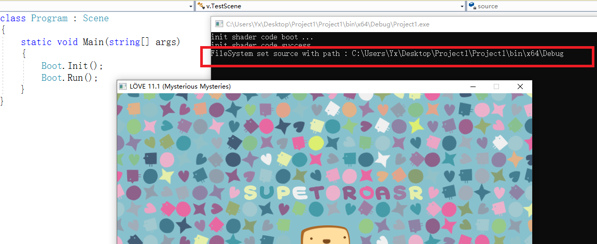
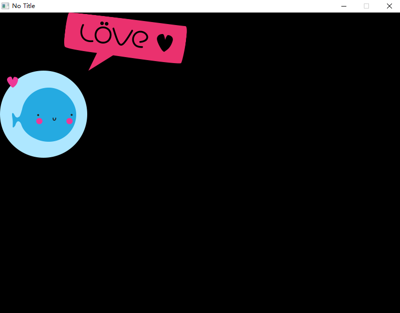
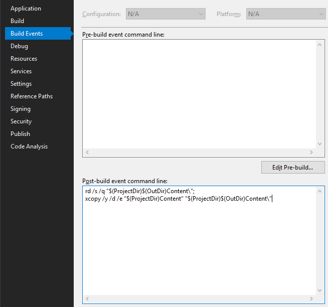

> 感谢、本章由 [fanbal@gitee](https://gitee.com/fanbal)  :smile: [完成](https://gitee.com/endlesstravel/love2dCS/issues/I3R7MY) 


# 绘制图像

基本图形与文本已经能够胜任一部分需求，但是您可能还希望在屏幕上呈现一些图片对吧？我们下面就要来实现它。

## 项目输出路径

首先我们需要确定Visual Studio为您建立输出的二进制文件所在的位置。
举个例子：如果您在`C:/Users/Yx/Desktop/Project1`这个目录下生成了解决方案, 那么它的二进制文件极有可能在`C:/Users/Yx/Desktop/Project1/Project1/bin/x64/Debug`中，当然，如果您以Release版本方式发布，最后的文件夹可能名为`Release`。



您需要将您的所有素材文件全部放到这个文件夹中（或者是子文件夹中）。


> 另见 ["Change Work Directory" or use "Automatic Content Export"](https://endlesstravel.github.io/#/tutorial/04.load-image?id=quotchange-work-directoryquot-or-use-quotautomatic-content-exportquot) 实现自动控制处理。

## 载入与绘制图片

```C#
using Love;
class Program : Scene
{
    Image logo;

    public override void Load()
    {
        // 从硬盘中导入图片。
        logo = Graphics.NewImage("love-logo.png");
    }

    public override void Draw()
    {
        // 在默认的(0, 0)位置将图片绘制出来。
        Graphics.Draw(logo);
    }

    static void Main(string[] args)
    {
        Boot.Init();
        Boot.Run(new Program());
    }
}

```



## 带有缩放与旋转的绘制


> 关于LÖVE中角度的细节：在LÖVE中，角度采用弧度制表示，它的介于0到2π(≈6.28)之间，不过当然您可能更习惯角度制。弧度制看起来有些落后，但这其实与LÖVE选用的坐标系有密切关系。角度表示一条边与X轴正方向形成的夹角，其中弧度0所代表的角度正好沿着X轴正方向，夹角为零。弧度¼π表示正右下角方向。½π表示竖直向下的Y轴正方向。角度随着弧度值的变化顺时针变化。

更多请看[Love.Graphics.Draw](https://endlesstravel.github.io/#/module/Love.Graphics?id=lovegraphicsdrawlovedrawablesystemsinglesystemsinglesystemsinglesystemsinglesystemsinglesystemsinglesystemsinglesystemsinglesystemsingle)

```C#
 using Love;
 class Program : Scene
 {
    Image logo = Graphics.NewImage("love-logo.png");

    public override void Draw()
    {
        Graphics.Draw(
            logo,
            400, 300, // 在(400, 300)位置绘制。
            90.0f * Mathf.Deg2Rad, // 旋转90°。
            0.5f, 0.5f, // 宽度与高度同时缩放50%。
            logo.GetWidth() * 0.5f, logo.GetHeight() * 0.5f,  // 将旋转锚点设在图片中心。
            0, 0 // 倾斜角度。
        );
    }

    static void Main(string[] args)
    {
        Boot.Init();
        Boot.Run(new Program());
    }
}
```


## 使用"新建文件夹"或"自动导出内容" 

在开发过程中，您将会生成debug与release两种类型的程序集，将素材文件手动放到输出文件夹(如`.../x64/Debug/` and `.../x64/Release/`)内是一件枯燥的事情，所以让我们通过自动化配置来处理这些琐碎。

1. 改变默认输出文件夹

<!-- To open the property pages, select the project in Solution Explorer and then select the Properties icon, or right-click the project and select Properties. -->

打开<b>属性</b>页：选择解决方案管理器的项目文件，选中属性图标(往往是一个扳手)，或者右键项目找到属性。

之后找到生成，找到最底层的输出部分，输入输出路径，为debug指定具体的工作目录。在C#中，默认工作目录为`..\bin\debug`。

修改路径为你到你的资源文件夹下，之后程序就可以在目标文件夹中启动了！

> 参考: https://docs.microsoft.com/en-us/visualstudio/debugger/project-settings-for-csharp-debug-configurations?view=vs-2019

2. 自动导出内容

<!-- It's a good practice to put all your asset files inside your project in a single place -- a folder with (potentially) many subfolders. For instance, if your project (the .csproj file) is at C:/MyGame/MyGame, then you could create a folder Content inside that folder and put all your assets in it. -->

将你的所有项目中资源文件集中导出到一块地方是一个非常不错的尝试。其中，导出目录可以具有多个子结构。举个例子，如果你的项目(`.csproj`文件格式)位于`C:/MyGame/MyGame`文件夹下，你能够在项目里面创建一个文件夹`"Content"`，并将所有资源放到新建的子文件夹下。

具体例子如下：
```
C:/MyGame/MyGame/
    Content/
        Fonts/
            SomeFreeFont.ttf
        Images/
            Player.png
            Enemy.png
        Sounds/
            EnemyDeath.ogg
            WeaponFire.ogg
    MyGame.csproj

```

<!-- Although we will not use these assets directly, we will copy them to the output folder (wherever that may be) whenever we make a build, using "post build actions" in Visual Studio. -->

尽管我们不能直接使用这些资源，我们可以通过将这些文件拷贝到你新建的输出目录下，具体用到的功能是Visual Studio项目属性页中的"生成事件"。

让我们右键打开项目的`属性`。


<!-- Select the Build Events tab and type the following into the Post-build event command line: -->
选择"生成事件"，在右侧的第二个文本框"生成后事件命令行"中键入命令：
```
rd /s /q "$(ProjectDir)$(OutDir)Content\";
xcopy /y /d /e "$(ProjectDir)Content" "$(ProjectDir)$(OutDir)Content\"
```



<!-- The first line removes the Content folder in the output folder, if it already exists. The second line copies the whole Content folder from your project folder to the output. This ensures that your asset files are always up to date. -->

第一行命令将会移除原先存在的`Content`文件夹，第二行将会将项目中的`Content`文件夹原封不动的拷贝到你的输出目录下，以此保证你的资源能够更新。

<!-- If you happen to have many megabytes worth of assets, this may become unwieldy, as removing and copying large files over and over would probably slow you down. In that case, you'll need a smarter solution. But for smaller projects, this might be just fine. -->

如果你有很多极占空间的资源，这可能会变得很麻烦，因为你会反复拷贝资源，占用电脑各方面的资源拖慢开发进度。所以如果是这种情况，你需要自己构思设计一个更巧妙的解决方案。不过对于比较小的项目，这么做是没有太大影响的。