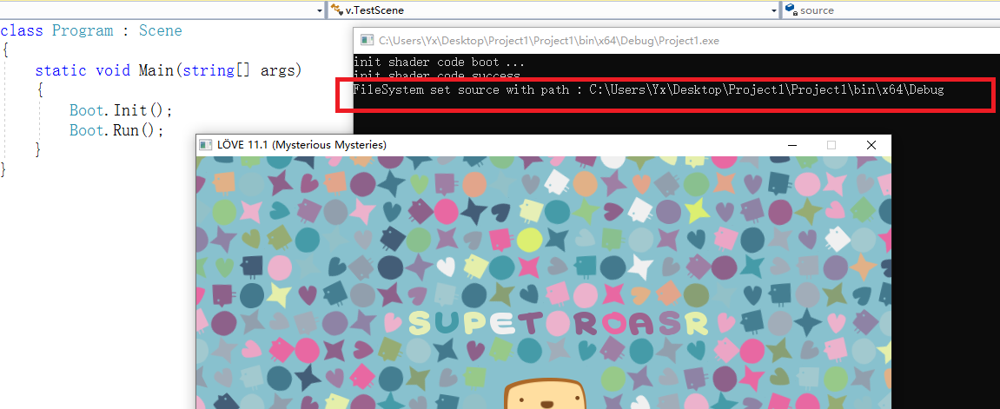
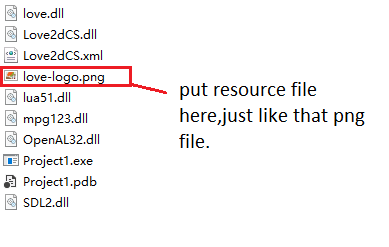
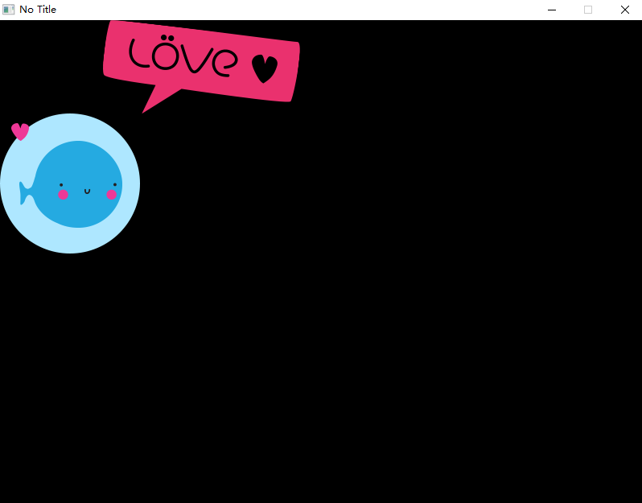
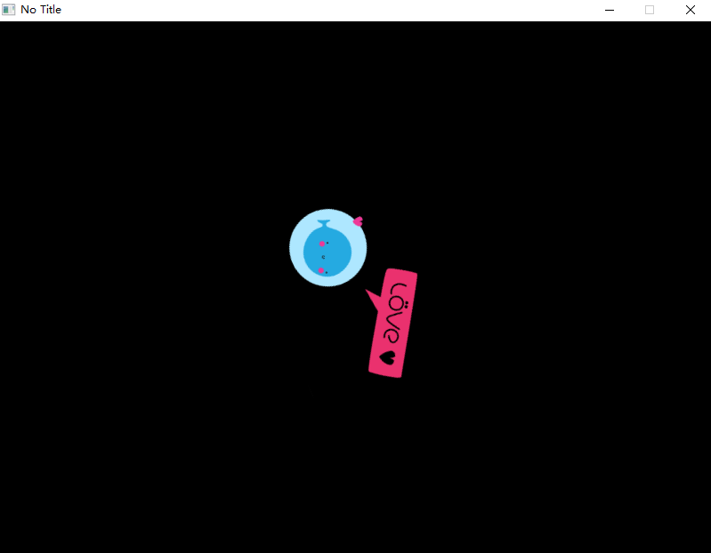
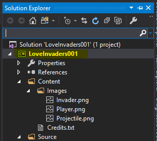
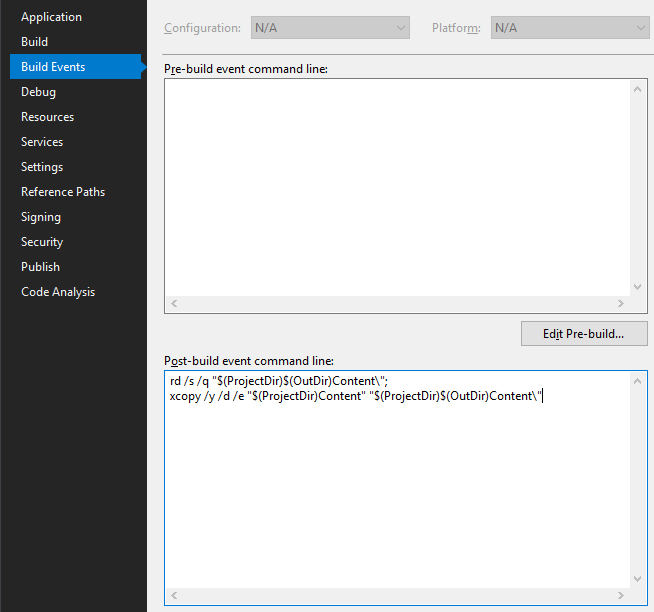

# Drawing Images

Basic shapes and text are nice, but you probably want to see some pictures on the screen, right? We'll look at how to do that here!

## Project Output Path

First, you need to determine where your binaries are being output when you build the project in Visual Studio. That's the root folder from which you will be loading assets, using relative filepaths.

For example, if your project is at `C:/Users/Yx/Desktop/Project1`, then the binaries will likely be at `C:/Users/Yx/Desktop/Project1/Project1/bin/x64/Debug`. The last folder may be `Release`, if you're building a release version.



You need to put all your asset files in that folder (or a subfolder of that folder).



> See the ["Change Work Directory" or use "Automatic Content Export"](#quotchange-work-directoryquot-or-use-quotautomatic-content-exportquot) section to see how to automate this process.

## Load & Draw the Image

```C#
using Love;
class Program : Scene
{
    Image logo;

    public override void Load()
    {
        // Load the image from the disk.
        logo = Graphics.NewImage("love-logo.png");
    }

    public override void Draw()
    {
        // And just draw it at 0,0.
        Graphics.Draw(logo);
    }

    static void Main(string[] args)
    {
        Boot.Init();
        Boot.Run(new Program());
    }
}
```



## Draw with Scale & Rotation

?> A note about angles in LÖVE: Angles are expressed in terms of radians, with values in the range from 0 to 2Π (approximately 6.28). You may be more used to working in terms of degrees. Because of how the coordinate system is set up, with an origin in the upper left corner, angles in LÖVE may seem a bit backwards: 0 points right (along the X axis), ¼Π points diagonally down and to the right, ½Π points directly down (along the Y axis), with increasing values continuing clockwise.

For more info, refer to [Love.Graphics.Draw](/module/Love.Graphics#lovegraphicsdrawlovedrawablesystemsinglesystemsinglesystemsinglesystemsinglesystemsinglesystemsinglesystemsinglesystemsinglesystemsingle).

```C#
    using Love;
    class Program : Scene
    {
        Image logo = Graphics.NewImage("love-logo.png");

        public override void Draw()
        {
            Graphics.Draw(
                logo,
                400, 300, // Draw at 400,300.
                90.0f * Mathf.Deg2Rad, // Rotate by 90°.
                0.5f, 0.5f, // Scale to 50% on both x and y.
                logo.GetWidth() * 0.5f, logo.GetHeight() * 0.5f,  // Take the image center as an anchor.
                0, 0 // Tilt degree.
            );
        }

        static void Main(string[] args)
        {
            Boot.Init();
            Boot.Run(new Program());
        }
    }
```


## "Change Work Directory" or use "Automatic Content Export"
Since you will make both debug and release builds during development, it would be tiresome to keep your asset files up to date in both output folders (e.g., `.../x64/Debug/` and `.../x64/Release/`). Let's automate this to make our lives easier!

#### 1. Change Default Working directory

To open the property pages, select the project in Solution Explorer and then select the Properties icon, or right-click the project and select Properties.

then checkout `Start options > Working directory` : Specifies the working directory of the app being debugged. In C#, the working directory is \bin\debug by default.

Change paht to your resources directory, then the program will start at that directory !

> reference : https://docs.microsoft.com/en-us/visualstudio/debugger/project-settings-for-csharp-debug-configurations?view=vs-2019

####  2. Automatic Content Export


It's a good practice to put all your asset files inside your project in a single place -- a folder with (potentially) many subfolders. For instance, if your project (the `.csproj` file) is at `C:/MyGame/MyGame`, then you could create a folder `Content` inside that folder and put all your assets in it.

Example:

```
C:/MyGame/MyGame/
    Content/
        Fonts/
            SomeFreeFont.ttf
        Images/
            Player.png
            Enemy.png
        Sounds/
            EnemyDeath.ogg
            WeaponFire.ogg
    MyGame.csproj
```

Although we will not use these assets directly, we will copy them to the output folder (wherever that may be) whenever we make a build, using "post build actions" in Visual Studio.

Right-click your project and go to `Properties`.



Select the `Build Events` tab and type the following into the `Post-build event command line`:

```
rd /s /q "$(ProjectDir)$(OutDir)Content\";
xcopy /y /d /e "$(ProjectDir)Content" "$(ProjectDir)$(OutDir)Content\"
```



The first line removes the `Content` folder in the output folder, if it already exists. The second line copies the whole `Content` folder from your project folder to the output. This ensures that your asset files are always up to date.

If you happen to have many megabytes worth of assets, this may become unwieldy, as removing and copying large files over and over would probably slow you down. In that case, you'll need a smarter solution. But for smaller projects, this might be just fine.

<!---
If your project is at `C:/LoveProjects/MyGame`, then the binaries will likely be at `C:/LoveProjects/MyGame/MyGame/bin/x64/Debug`. The last folder may be `Release`, if you're building a release version.
--->