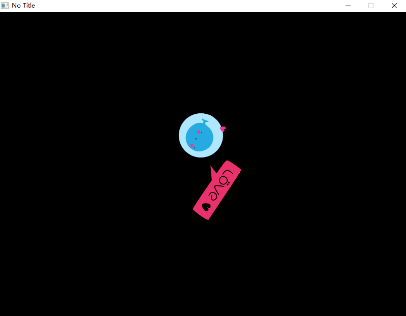

# Basic Graphics

> In this chapter you will learn how to draw a image.

!> Since love's original API only has access to the root folder of the program and the the root folder of the game's save directory, the Love.Resource module has been added here to access files such as `C:/xxx.png`.

### First you need to know.

First you need to find out which folder your program files are running in. You can directly find the path of your program running in the console output.

As show as below, my program run at `C:\Users\Yx\Desktop\Project1\Project1\bin\x64\Debug` .

And then open directory `C:\Users\Yx\Desktop\Project1\Project1\bin\x64\Debug` and put all resource file you need.

Folders like this:


I put `love-log.png` place to this directory.
### load a image and draw it on the screen.
```C#
    using Love;
    class Program : Scene
    {
        Image logo;

        public override void Load()
        {
            // load the image on the disk
            logo = Resource.NewImage("love-logo.png");
        }

        public override void Draw()
        {
            // draw image at position (0, 0)
            Graphics.Draw(logo);
        }

        static void Main(string[] args)
        {
            Boot.Init();
            Boot.Run(new Program());
        }
    }
```

---------

### Draw a smaller, rotaion image .
?> A note about angles in LÖVE: Angles are expressed in terms of radians, with values in the range of 0 to 2Π (approximately 6.28); you may be more used to working in terms of degrees. Because of how the coordinate system is set up, with an origin in the upper left corner, angles in LÖVE may seem a bit backwards: 0 points right (along the X axis), ¼Π points diagonally down and to the right, ½Π points directly down (along the Y axis), with increasing values continuing clockwise.

More parameter can find at [Love.Graphics.Draw](/module/Love.Graphics#lovegraphicsdrawlovedrawablesystemsinglesystemsinglesystemsinglesystemsinglesystemsinglesystemsinglesystemsinglesystemsinglesystemsingle)
```C#
    using Love;
    class Program : Scene
    {
        Image logo = Resource.NewImage("love-logo.png");

        public override void Draw()
        {
            Graphics.Draw(logo,
                400, 300, // draw at position (400, 300)
                90, // roation 90°
                0.5f, 0.5f, // sacle to (0.5f, 0.5f)
                logo.GetWidth() * .5f, logo.GetHeight() * .5f,  // Take the image center as an anchor
                0, 0); // Tilt degree
        }

        static void Main(string[] args)
        {
            Boot.Init();
            Boot.Run(new Program());
        }
    }
```

---------

