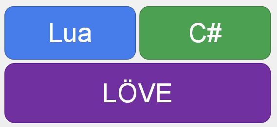
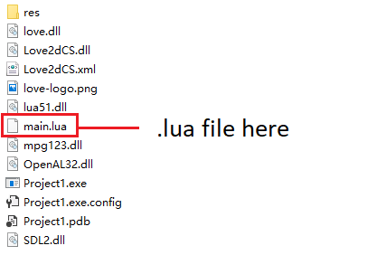
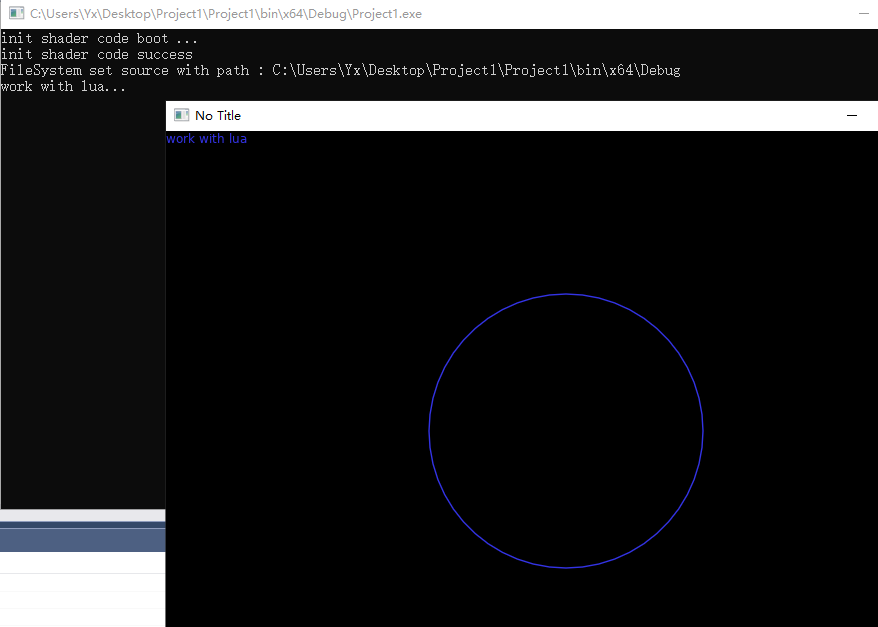

# Work with lua

> In this chapter you will learn how to work with lua code.

---------
### 📜 Summary

Lua and C# code are coexisting, and they can call the LÖVE engine.



api that you can use:


#### Love.Lua.DoString(string luaCode)
execuate lua code.

`luaCode`: lua code to execuate.

#### Love.Lua.Update(float dt)
call love.update(dt)

`dt`: time frame passed.
#### Love.Lua.Draw()
call love.draw()


---------
### 📜 First you need to know.

First you need to find out which folder your program files are running in. You can directly find the path of your program running in the console output.

As show as below, my program run at `C:\Users\Yx\Desktop\Project1\Project1\bin\x64\Debug` .

And then open directory `C:\Users\Yx\Desktop\Project1\Project1\bin\x64\Debug` and put all resource file you need.

Folders like this:



I put `main.lua` place to this directory.

---------
### 📜 specify a file as lua entry point and call it each frame update.
Lua code write it into `main.lua`
```lua
radius = 10;

function love.load()
    print("work with lua...") -- write to console
end

function love.update(dt)
    radius = radius + dt * 10
end

function love.draw()
    love.graphics.setColor(1, 0, 1)
    love.graphics.circle("line", 400, 300, radius)
end
```
C# code
```C#
    using Love;
    class Program : Scene
    {
        public override void Update(float dt)
        {
            Lua.Update(dt); // call love.update
        }

        public override void Draw()
        {
            Lua.Draw(); // call love.draw
            Lua.DoString("love.graphics.print('work with lua')"); // execute lua code
        }

        static void Main(string[] args)
        {
            Boot.Init(new BootConfig
            {
                LuaLoveMainFile = "main" // specify file name
            });
            Boot.Run(new Program());
        }
    }
```

result :

---------