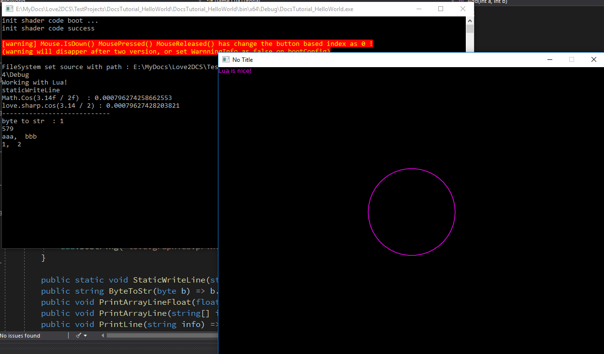

# Working with Lua

Since [LÖVE](https://love2d.org/) uses the [Lua](http://www.lua.org/) language to write basically all the game logic, it is only natural that Love2DCS also supports Lua. Although the point of this C# port of the LÖVE framework is to take advantage of the C# language itself, mainly for its productivity, type safety, and excellent tooling, you can still write almost everything in Lua, if you want.

Lua and C# code can coexist, and both can make calls to the framework. You can implement one feature in C# and another in Lua. The choice is entirely up to you.


## Setup

To use Lua, we only need 3 things:

1. Write a Lua file and put it into the ouput folder.
1. Load the Lua file.
1. Invoke subsequent Lua callbacks from C# code.

### 1. Lua File

First, let's create a new file, `main.lua`, and put it in the output folder. If you're unsure about where that is, please refer to the [Project Output Path](/tutorial/04.load-image.md#project-output-path) section in the previous article. Also take a look at the [Automatic Content Export](/tutorial/04.load-image.md#automatic-content-export) section to automate things.

Let's implement the three core callbacks we know from previous articles:

```Lua
local radius = 10

function love.load()
    -- You can write to the console.
    print("Working with Lua!")
end

function love.update(dt)
    radius = radius + dt * 10
end

function love.draw()
    love.graphics.setColor(1, 0, 1)
    love.graphics.circle("line", 400, 300, radius)
end
```

!> Only `love.load`, `love.update`, and `love.draw` callbacks are natively supported. However, you can use `Love.Lua.DoString()` to execute any valid Lua code.

### 2. Load Lua File

To run any Lua code, we need to initialize the Lua module and load the main Lua file that serves as an entry point into the Lua world. `Love.Lua.Load` does all this in a single call:

```C#
public class LuaTutorial : Scene
{
    public override void Load()
    {
        Lua.Load("main.lua");
    }
}
```

### 3. Invoke Lua Callbacks from C&#35;

Add these calls to your C# code:

```C#
public override void Update(float dt)
{
    // Invoke the love.update() function in the Lua file.
    Lua.Update(dt);
}

public override void Draw()
{
    // Invoke the love.draw() function in the Lua file.
    Lua.Draw();

    // Execute arbitrary Lua code.
    Lua.DoString("love.graphics.print('Lua is nice!')");
}
```

Being able to make these calls manually gives you a finer control over how you want to interact with Lua scripts.

## Result


You should see a violet text "Lua is nice!" and a growing violet circle at the center of the screen.

## Lua -> C&#35; Communication

So, we can call the main functions from C# to Lua, and that very well may be all you'll ever need. But what if you need to communicate something from Lua back to the C# world? No worries, Love2DCS supports this.

Just after loading a Lua file, you can register methods and functions using `Love.Lua.RegisterFunction`. Then, from Lua, you call `love.sharp.[function_name]` to call the registered function.

```C#
public class LuaTutorial : Scene
{
    public override void Load()
    {
        Lua.Load("main.lua");

        // To register a static function, pass in the type.
        Lua.RegisterFunction(typeof(Math), "Cos", "cos");
        Lua.RegisterFunction(typeof(LuaTutorial), "StaticWriteLine", "staticWriteLine");

        // To register a method, pass in the object.
        Lua.RegisterFunction(this, "Add", "add");
        Lua.RegisterFunction(this, "PrintLine", "printLine");
        Lua.RegisterFunction(this, "PrintArrayLine", "printArrayLine");
        Lua.RegisterFunction(this, "PrintArrayLineFloat", "printArrayLineFloat");
        Lua.RegisterFunction(this, "ByteToStr");

        // Remember, you can execute any arbitrary Lua code using Lua.DoString.
        Lua.DoString(" love.sharp.staticWriteLine('staticWriteLine') ");

        Console.WriteLine("Math.Cos(3.14f / 2f)  : " + Math.Cos(3.14f / 2f));
        Lua.DoString(" love.sharp.staticWriteLine('love.sharp.cos(3.14 / 2) : ' ..  love.sharp.cos(3.14 / 2)) ");
        Lua.DoString(" love.sharp.printLine('----------------------------') ");
        Lua.DoString(" love.sharp.printLine('byte to str  : ' ..  love.sharp.ByteToStr(1)) ");
        Lua.DoString(" love.sharp.printLine(love.sharp.add(123, 456)) ");
        Lua.DoString(" love.sharp.printArrayLine({ 'aaa', 'bbb' }) ");
        Lua.DoString(" love.sharp.printArrayLineFloat({ 1, 2 }) ");
    }

    public override void Update(float dt)
    {
        Lua.Update(dt);
    }
    public override void Draw()
    {
        Lua.Draw();
    }

    public static void StaticWriteLine(string info) => Console.WriteLine(info);
    public string ByteToStr(byte b) => b.ToString();
    public void PrintArrayLineFloat(float[] info) => Console.WriteLine(string.Join(",  ", info));
    public void PrintArrayLine(string[] info) => Console.WriteLine(string.Join(",  ", info));
    public void PrintLine(string info) => Console.WriteLine(info);
    public int Add(int a, int b) => a + b;
}
```

You should see something like this:




<!---
api that you can use:

#### Love.Lua.DoString(string luaCode)
execuate lua code.

`luaCode`: lua code to execuate.

#### Love.Lua.Update(float dt)
call love.update(dt)

`dt`: time frame passed.
#### Love.Lua.Draw()
call love.draw()


---------
### 📜 First you need to know.

First you need to find out which folder your program files are running in. You can directly find the path of your program running in the console output.

As show as below, my program run at `C:\Users\Yx\Desktop\Project1\Project1\bin\x64\Debug` .

And then open directory `C:\Users\Yx\Desktop\Project1\Project1\bin\x64\Debug` and put all resource file you need.

Folders like this:


I put `main.lua` place to this directory.

---------
### 📜 specify a file as lua entry point and call it each frame update.
Lua code write it into `main.lua`

C# code


result :

---------
--->