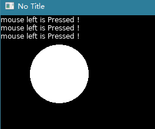

# Mouse input

in this chapter you should learn how to:

* get mouse button status

* get/set mouse postion

### the function table

* button function

|function              | description
|----------------------|----------------
|Mouse.IsDown          | Checks whether a certain button is down.
|Mouse.IsPressed       | Checks whether a certain button Is Pressed. [#50](https://github.com/endlesstravel/Love2dCS/issues/50)
|Mouse.IsReleased      | Checks whether a certain button Is Released. [#50](https://github.com/endlesstravel/Love2dCS/issues/50)

* position function

|function              | description
|----------------------|----------------
|Mouse.GetX	           | Returns the current x-position of the mouse.
|Mouse.GetY            | Returns the current y-position of the mouse.
|Mouse.GetPosition     | Returns the current position of the mouse.
|Mouse.SetPosition	   | Sets the current position of the mouse.
|Mouse.GetPreviousPosition | Returns the last frame position of the mouse. [#49](https://github.com/endlesstravel/Love2dCS/issues/49)
|Mouse.GetPreviousX | Returns the last frame x-position of the mouse. [#49](https://github.com/endlesstravel/Love2dCS/issues/49)
|Mouse.GetPreviousY | Returns the last frame y-position of the mouse. [#49](https://github.com/endlesstravel/Love2dCS/issues/49)

* cursor function

|function              | description
|----------------------|----------------
|Mouse.SetVisible	| Sets the current visibility of the cursor.
|Mouse.IsVisible	| Checks if the cursor is visible.
|Mouse.IsCursorSupported |	Gets whether cursor functionality is supported.
|Mouse.NewCursor	| Creates a new hardware Cursor object from an image.
|Mouse.SetCursor	| Sets the current mouse cursor.
|Mouse.GetCursor	   |Gets the current Cursor.
|Mouse.GetSystemCursor |	Gets a Cursor object representing a system-native hardware cursor.

### Mouse button status

use `Mouse.IsDown` to get current button status.

use `Mouse.IsPressed` to get is button is pressed.



```C#
    class Tutorial_06 : Scene
    {
        string mouseText = "";

        public override void Update(float dt)
        {
            if (Mouse.IsPressed(Mouse.LeftButton))
            {
                mouseText += "mouse left is Pressed !\n";
            }
        }

        public override void Draw()
        {
            Graphics.Print(mouseText);

            if (Mouse.IsDown(Mouse.MiddleButton))
            {
                Graphics.Circle(DrawMode.Fill, 100, 100, 50);
            }
        }
    }
```

### Mouse Position
use `Mouse.GetPosition` to get position in window
```C#
    class Tutorial_06 : Scene
    {
        public override void Draw()
        {
            var mousePos = Mouse.GetPosition();
            Graphics.Circle(DrawMode.Line, mousePos, 50);
        }

        static void Main()
        {
            Boot.Init();
            Boot.Run(new Tutorial_06());
        }
    }
```

### Change mouse system cursor

> press [1-6] to changet system curosr. press [space] change to default mouse curosr

```C#
    class Tutorial_06 : Scene
    {
        public override void Update(float dt)
        {
            var dict = new Dictionary<KeyConstant, SystemCursor>()
            {
                { KeyConstant.Space, SystemCursor.Arrow },
                { KeyConstant.Number1, SystemCursor.Hand },
                { KeyConstant.Number2, SystemCursor.Crosshair },
                { KeyConstant.Number3, SystemCursor.Ibeam },
                { KeyConstant.Number4, SystemCursor.SizeAll },
                { KeyConstant.Number5, SystemCursor.No },
                { KeyConstant.Number6, SystemCursor.SizeNWSE },
            };

            foreach (var kv in dict)
            {
                if (Keyboard.IsPressed(kv.Key))
                    Mouse.SetCursor(kv.Value);
            }

            if (Keyboard.IsPressed(KeyConstant.Space))
                Mouse.SetCursor();
        }

        public override void Draw()
        {
            Graphics.Print(" press [1-6] to changet system curosr   \n  press [space] change to default mouse curosr !");
        }
    }
```